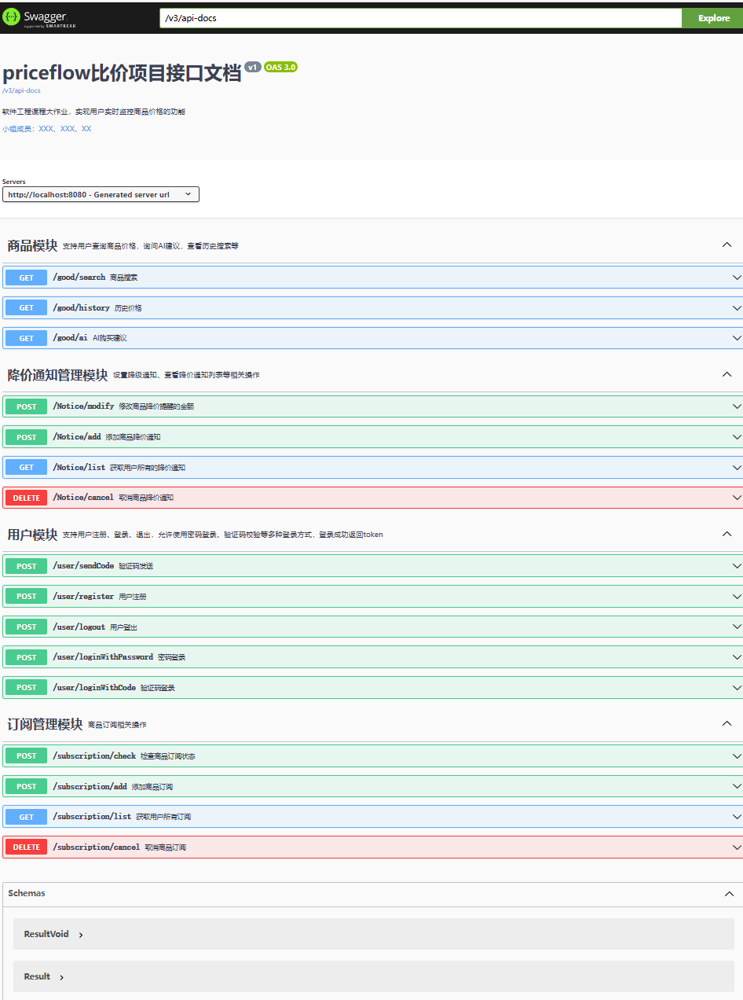

# PriceFlow

武汉大学软件工程大作业，小组成员：XXX、XXX、XX

## 后端
使用springBoot框架，使用IDEA启动后，默认允许的端口号为：localhost:8080
### API文档
启用后端项目后，使用swagger自动生成接口文档，访问地址为![http://localhost:8080/swagger-ui/index.html#/]  
接口文档效果图如下图所示：  

